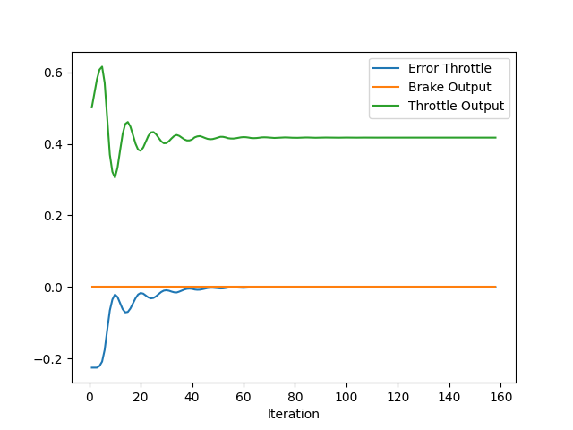
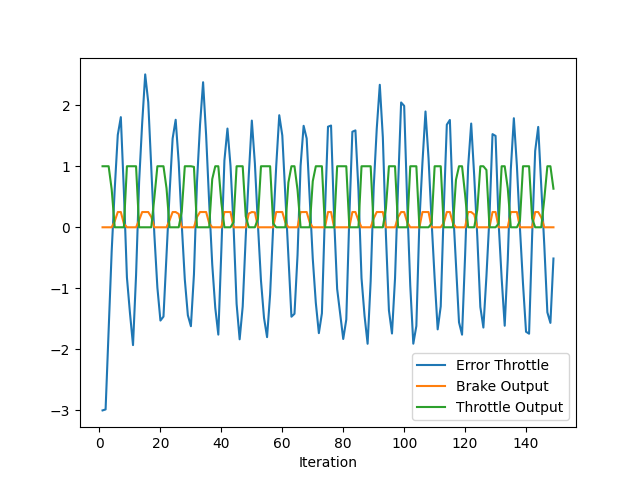
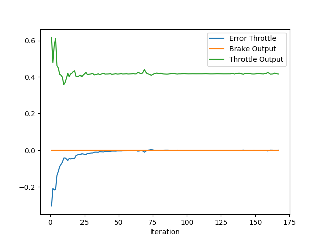

# Project: Control and trajectory tracking for AVs using Carla

# Overview

Based on an existing behavior and path planner (created in the previous project), 
create a longitudinal and lateral controller so that the 
simulated vehicle in Carla follows the requested trajectory and avoids the obstables.

# Solution

A PID controller is implemented and integrated into the provided framework for 
throttle and steering control. Several fixes are added to the framework and simulation
client to make the control smooth(er) and more stable. The twiddle optimization method is used for tuning the controller parameters 
in multiple successive stages. Finally a short evaluation is provided of the controllers.

Video running at 2x the original simulation speed.

See the [video in higher quality](videos/control_success_small.mp4). Or check out
another 
[video of what it was like when things did not really work as expected](videos/control_fail_small.mp4) .

In order to see all changes I made compare it to the [last commit of the framework](https://github.com/yosuah/nd013-c6-control-starter/compare/78a74704cc25fcbe92e188eb0f3204832f8febd5...HEAD). All NOTE comments are by me (but TODO comments were already in the code).

# Running

Do the setup magic (when on Udacity's servers):
* `cd nd013-c6-control-starter/project`
* `./install-ubuntu.sh`

Start Carla:
* `su - student`
* `cd /home/workspace/nd013-c6-control-starter/project`
* `./run_carla.sh`
  * This will restart Carla every time it is killed (which is after every simulation)

Generate the final results - does two executions, one without obstacles and one with them:
* `./do.sh run`

Run the full optimization - runs several simulations and outputs the best set of parameters:
* `./do.sh optimize`

# Description

## Controller

A regular PID controller is implemented and used for both throttle and steering control.

For throttle control the required acceleration from the current velocity to the final velocity
of the trajectory is calculated (given the distance). Ideally I believe we should control
from the current state to the next one, not the last one, but due to internal inconsistencies 
this proved to work better. Also I tried controlling simply based on the required velocity
change, but I could not get rid of oscillation in that case, while using the required
acceleration as the input produced fairly smooth control signal.

For steering control the distance of the last waypoint from the 
current direction of travel is calculated. The direction of travel is calculated as 
a straight line based on the current yaw, not taking into account the direction of
the front wheel, which is a very simplistic approximation. It works in the current
simulation, though it can be seen that this produces very large error values even
for moderate steering.

## Parameter optimization

Parameter optimization is performed using the twiddle algorithm, which is based
on making iterative changes to each parameter while an improvement is seen, 
reducing the magnitude of the change if better values are not found. For the evaluation
of the goodness of a set of parameters I used two metrics: the mean absolute value of the
throttle error and the mean absolute value of the steer error, as seen by the controller
in the C++ client. Each simulation was executed for the same number of iterations to get 
comparable results, and the mean is calculated over the distance travelled in the given
simulation (and not the time). This was important because if time was used then a controller
which applied very little throttle and hence barely started the vehicle could achieve
a very low mean throttle error, which would be undesirable. 

Unfortunately the simulation is not fully deterministic, and multiple executions for exactly
the same parameter set yield different error values - this limits the usefulness of
parameter optimization and prohibits finding a perfect result. This could partially be caused
by the fact that I calculated the error seen by the controller (in the C++ client), so the
accuracy of the error calculation is limited by the update frequency between the C++ client
and the simulator. Ideally the error should be calculated in the Python Carla client which performs
the frequent world updates, which would increase the accuracy and hopefully make the
results more consistent across runs.

The final scene used for evaluation contains obstacles, causing the planner to calculate
relativel complex path both longitudinally (speed up/braking) and laterally (steering, 
lane changes). These situations are too challenging if the controllers are not properly
tuned, and an error in one controller can cause the situation to be unsolvable also for the
other - for example if the throttle controller works as a 'bang-bang' controller causing
extremely accelerations then decelerations then the steering controller is almost guaranteed
to also fail at following the required path, even if the steering parameters themselves are
correct.

In order to overcome this I performed optimization in different scenes separating the features: 
first only the throttle controller was optimized in an empty
scene for maintaining a fixed reference speed, and after this was the steering controller
optimized with the obstacles added to the scene, but without using the throttle controller. 
For the throttle controller first a 
reasonable Kp value was searched, so that the vehicle at least starts and roughly achieves
the desired speed, and only after this were all three parameters (Kp, Ki, Kd) jointly 
optimized. In case of the steering controller all three parameters were optimized at the
same time, but the speed of the vehicle was (roughly) constant. Ideally I should have added
more complex scenarios as well, for example in the throttle controller acceleration was tested
much more heavily than braking, so adding a "stop behind this vehicle" would make the
results more balanced, but this was not needed to achieve acceptable results for this project.

The final set of parameters used:

|                   | Kp  | Ki  | Kd    |
|---                |---  |---  |---    |
| Steering control  | 0.1 | 0.0 | 0.0125| 
| Throttle control  | 2.0 | 0.8 | 0.1   |

## Evaluation

The following plots show the error calculated and he control output for both controllers.
The x axis shows iterations, which are 20ms each.

This figure shows the throttle controller in case of an empty scene (no obstacles) and
a constant reference speed of 3m/s. It can be seen that it takes a long time to reach
the desired speed (the controller is damped) and even despite this, some oscillation is
clearly visible. The osciallation is reduced, but not removed by the differential term
in the controller. It can also be seen that initially the error is reduced quickly (caused
by the proportional term), but then the equalibrium is reached slowly - this is caused
by the slow buildup of the integral term. Increasing the integral term further could
reduce this time, but could also cause instability in more dynamic scenarios.

As a comparison the following figure shows the same scenario when the error input to
the controller was just the speed difference between the current state and the final
waypoint (not the acceleration). This shows a continuous osciallation and the controller 
behaving as a bang-bang controller, despite using parameter search in this case as well.
This method was not used later.

The following figure shows the same values in case of the final simulation, where 
there are obstacles in the scene and the reference speed is calculated by the behavior
planner. The more varying nature of the scene make it harder to draw conclusions
about the controller itself, but it can be seen that the error term is rather similar
to the previous plot, meaning that in the majority of the scenario the controller
was instructed to move with roughly the same speed (3m/s, which is set as the speed
limit in the simulation), with some minor fluctuations. This means that optimizing
on the empty scene was a good strategy for getting results on the final scene, but
it also means that braking is not properly tested.

The final figure shows the steering controller error and output in case of a scene 
with obstacles. There are three parts of the timeline where the error got really large,
these are the 3 moments when the vehicle was passing by obstacles and had to perform
lane changes. It can be seen from the error curve that the steering controller is also
affected by oscillation, so probably further tweaking of the derivative parameter
would be necessary. However some of this osciallation can also be caused by delay between
the controller and the simulation, or other mismatches - for example the root cause
might be that the controller plans too far ahead (gets the last waypoint), but the
update is called more frequently, so the error always seem larger than what it really is.

## Possible improvements

- Selecting different gain values for different cases (for acceleration and braking, or
  based on the current gear)
- Accounting for the current acceleration and the current direction of the front wheel
  when calculating the control errors.
- Calculating an intermediate waypoint based on the requested trajectory that is exactly
  at one time step ahead (20ms with the current parameters) and submitting this as the
  desired position for the controller. Currently the last waypoint is selected, which
  is too far ahead.
- More scenarios for performing parameter search, especially to better test stopping behavior
- Calculating the error of the simulation after each update step in the simulator,
  as opposed to calculating it in C++ more infrequently.
- Calculating a different/other measures when evaluating parameters. For example
  squared (as opposed to absolute) error would punish larger deviations more heavily,
  or a specific term could be added that punishes oscillatory behavior, even if the
  amplitude is small.

## Changes to the framework

I had to make several changes to the provided framework to make the analysis possible.
I did not intend to tweak it so heavily, but I could not get acceptable results without
this. I believe some of these were actually bugs in the original code. Some of the
more important changes made:

- The frequency of sending updates to the C++ client/controller is fixed at 20ms. Originally this was varying, 
  based on how fast the vehicle is moving, how far the waypoints are, etc., which caused 
  the controller to be updated anywhere between 20ms and 5 seconds (!).
- The behavior planner is forced to re-plan the whole trajectory from the current state
  in each update cycle. Originally once a waypoint was calculated, it was added to the
  reference trajectory and never changed later, and the behavior planner only appended new waypoints
  at the end of this list. This caused problems because when there is a large mismatch
  between what the behavior planner expected to happen (calculated several cycles ago)
  and what actually happened, then the behavior planner continued to append new waypoints
  *based on a false imagined state*, making the whole situation even worse. This has
  happened quite often while doing parameter optimization. There were other smaller
  mismatches between how the behavior planner, the controller and the simulator sees the 
  world which caused problems like this - making sure that planner always fully re-plans 
  reduced these issues.
- An upper bound is added to the distance on where the last waypoint can be selected
  (which is also the goal tracked by the bahvior planner). Previously this was unbounded,
  causing the goal to get extremely far when the controller was lagging (e.g. when the
  throttle controller provided too small acceleration).
- The simulated car has an automatic gearbox and changed gears while speeding up. This
  caused changes in the required acceleration output even to maintain constant acceleration
  or speed and could itself cause oscillatory behavior. I have fixed to use a single gear,
  which is of course unrealistic, but might make the problem a bit easier.

## Project questions

Answer the following questions:
- Add the plots to your report and explain them (describe what you see)
  - *See [Evaluation](#evaluation)*
- What is the effect of the PID according to the plots, how each part of the PID affects the control command?
  - *See [Evaluation](#evaluation)*
- How would you design a way to automatically tune the PID parameters?
  - *See [Parameter optimization](#parameter-optimization)*
- PID controller is a model free controller, i.e. it does not use a model of the car. 
  Could you explain the pros and cons of this type of controller?
  - The pros are that it is a conceptually simple controller that can be applied to many
  different problems without changes. Creating an initial version of the controller for
  a new problem is easy, as not expert knowledge is required about the underlying system,
  and the parameters to be tuned are general and easy to understand. Calculating the output
  is also computationally easy, making it suitable for real-time applications even in 
  case of limited reasources (e.g. small microcontrollers).
  - On the other hand this does not mean that achieving good control is easy: only having 
  a limited number of parameters means that finding an always-correct combination may not 
  be possible. Not having an internal model of the system means that incorporating knowledge
  of important aspects of the system is not possible in the controller and must be accounted
  for externally. For example if we know that the effect of a given control signal on the system
  depends on the current state like the current gear then we need to
  account for this outside of the controller - for example by applying a different gain parameter
  on the output. A controller with an internal model could be better at accounting for
  factors like this, assuming that the model is reasonably accurate, which requires
  expert knowledge or tedious identification measurements. Another factor that is very
  difficult to handle with a PID controller is delays, which could be better dealt with
  by controllers that perform forward simulation.
- (Optional) What would you do to improve the PID controller?
  - *See [Possible improvements](#possible-improvements)*
